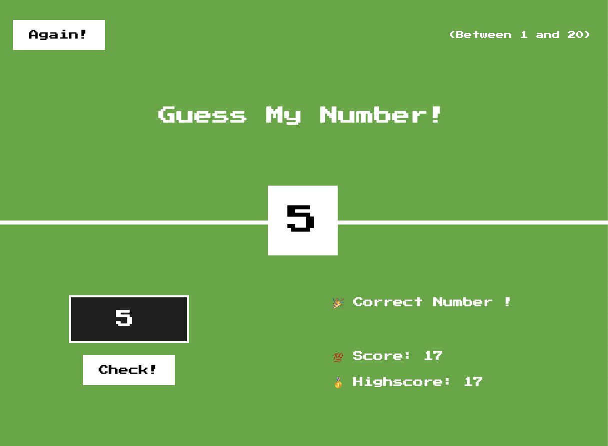

# guess-the-number
Guess the number game developed in HTML, CSS, JavaScript with TailwindCSS framwork

## Usage

Clone the repo 
```sh
git clone https://github.com/WankhedeAmey/guess-the-number.git
```

Add the dependencies
```sh
node install
```

Open the ```index.html``` in any browser and play the game!


## Demo


<br>

<br>


